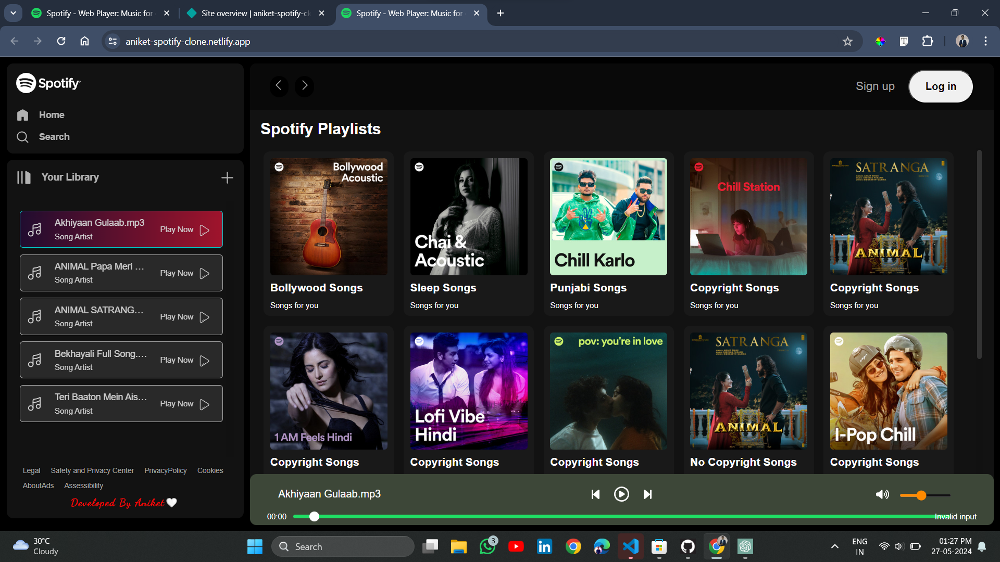

# 🎵 Spotify Clone Music App

Welcome to my **Spotify Clone Music App** project! This application is designed to provide a seamless music streaming experience, inspired by the popular music platform, Spotify. Dive into the world of music with a sleek interface, user-friendly features, and responsive design.

## 🌟 Features

- **Playlist Selection**: Choose from various playlists and enjoy songs that play automatically in sequence.
- **User Authentication**: Secure login and signup functionalities for a personalized experience.
- **Responsive Design**: Optimized for all devices, ensuring a consistent and beautiful interface whether you're on a desktop, tablet, or smartphone.
- **Add Your Own Playlists**: *Coming Soon!* Easily add your own folders to the song playlists with a simple click of the '+' icon.

## 🚀 Technologies Used

- **Frontend**: HTML, CSS, JavaScript

## 📸 Screenshots



## 📂 Project Structure

```plaintext
.
├── assets
├── songs
├── favicon.ico
├── index.html
├── login.js
├── signup.js
├── style.css
└── utility.css
```

## 🚧 Installation and Setup

1. **Clone the repository:**
   ```bash
   git clone https://github.com/aniketitankar-03/Apna-Spotify-Clone.git
   ```
2. **Navigate to the project directory:**
   ```bash
   cd apna-spotify-clone
   ```
3. **Open `index.html` in your preferred browser.**

## 🌐 Live Demo

https://aniket-spotify-clone.netlify.app/

## 🙌 Contributing

Contributions are welcome! Feel free to open issues or submit pull requests for any improvements or bug fixes.

## 📧 Contact

For any inquiries or feedback, please reach out to me at aniketitankar9281@gmail.com.

---

Thank you for visiting the project. Enjoy the music! 🎶

---